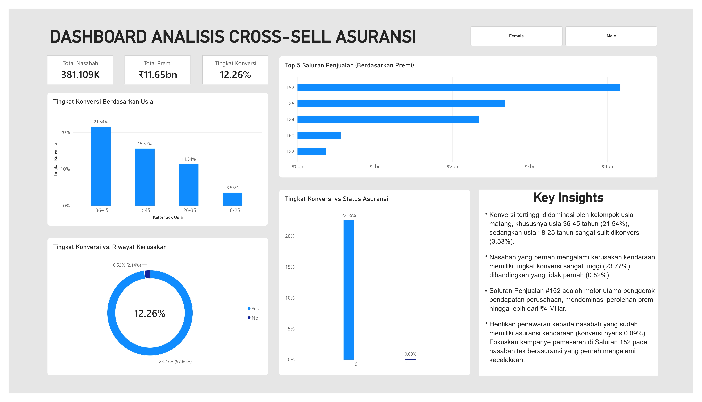

# Vehicle Insurance Cross-Sell Analysis

## Project Overview
This project focuses on analyzing customer data to identify the best prospects for a cross-selling campaign. The core business objective is to help an insurance company determine which of their existing health insurance policyholders would most likely be interested in purchasing vehicle insurance.

By building an interactive dashboard in **Power BI**, this project transforms raw customer demographics, vehicle history, and policy engagement data into actionable business insights. The visual analytics are designed to empower the marketing team to optimize their advertising budget, target the right audience accurately, and significantly improve overall conversion rates.

## Dataset Source
The dataset used for this dashboard is sourced from **Kaggle**: [Health Insurance Cross Sell Prediction](https://www.kaggle.com/datasets/anmolkumar/health-insurance-cross-sell-prediction).

*Note: This is a publicly available synthetic dataset widely used for data analytics practice. It was specifically selected for this portfolio project to demonstrate practical skills in data analysis using SQL and Power BI.*

## Process Diary: Step-by-Step Workflow

This project was executed through a simple data analysis pipeline, demonstrating a workflow from data extraction to visualization:

### 1. Data Acquisition & Cleaning (Microsoft Excel)
*   Acquired the raw dummy dataset from Kaggle.
*   Performed initial data profiling, formatting, and preliminary cleaning in Excel to ensure data integrity before importing it into the database.

### 2. Database Creation & Normalization (SQL)
*   Imported the cleaned dataset into a SQL database environment.
*   Applied database normalization concepts by splitting the flat dataset into **3 relational tables** (e.g., Customer Demographics, Vehicle History, and Policy/Sales Data). This step was crucial for optimizing data storage and learning about **Star Schema model** for analysis.

### 3. Dashboard Development (Power BI)
*   Connected Power BI directly to the SQL database to load the relational tables.
*   Learned to design a simple dashboard focusing on data storytelling, clean aesthetic, and proper alignment.
*   **Built the following visual components:**
    *   **3 KPI Cards:** Highlighting *Total Customers*, *Total Annual Premium*, and overall *Conversion Rate* using the 'New Card' visual.
    *   **4 Analytical Charts:** 
        *   Conversion Rate by Age Group (Column Chart)
        *   Conversion Rate vs. Vehicle Damage (Donut Chart)
        *   Top 5 Sales Channels by Premium (Filtered Horizontal Bar Chart)
        *   Conversion Rate vs. Insurance Status (Column Chart with categorical X-axis)
    *   **Interactive Slicer:** Implemented a 'Tile' style slicer for *Gender* filtering (Male/Female) enabling cross-filtering.
    *   **Key Insights Panel:** Integrated a dedicated text section to highlight actionable business recommendations for stakeholders.

### 4. Final Product Deployment
*   Finalized the dashboard layout, applied consistent color palettes, and removed unnecessary default technical labels.
*   Exported the final interactive dashboard view into a high-resolution `.jpg` format, which is displayed above.

## Key Business Insights

Based on the interactive dashboard analysis, here are the actionable insights for the marketing and sales teams:

1. The highest cross-sell conversion rates are found within the mature age group, specifically **36-45 years old (21.54%)**. In contrast, the younger demographic (18-25 years old) shows a minimal conversion rate (3.53%). **Marketing campaigns should be heavily targeted toward the 36-45 age bracket**.
Customers with a history of **vehicle damage** have a drastically higher response rate (**23.77%**) compared to those without prior damage (0.52%). This serves as the strongest behavioral indicator for cross-selling success.
3. **Sales Channel 152** is the primary revenue driver, generating over **₹4 Billion** in total premiums. Resources should be prioritized to optimize this specific channel.
4. Minimize marketing efforts directed at customers who already have vehicle insurance, as their conversion rate is virtually non-existent (**0.09%**). 

## Strategic Conclusion
To maximize Return on Investment (ROI), the advertising and outreach budget should be strictly focused on **uninsured customers with a history of vehicle damage, particularly within the 36-45 age group, predominantly utilizing Sales Channel 152**.
